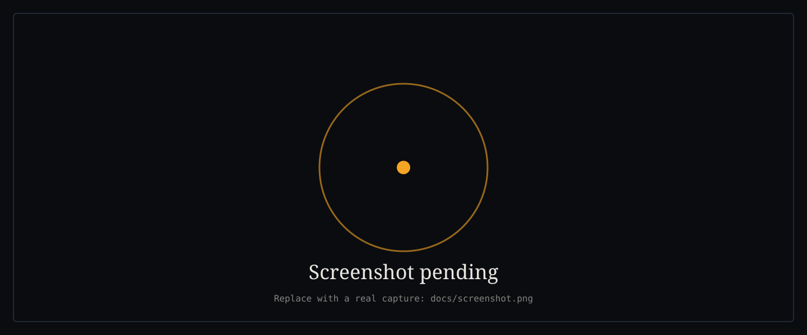
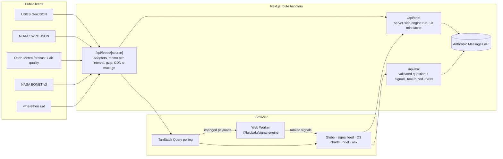

# Earth Signals

A live dashboard that pulls free public planetary feeds, runs statistical anomaly detection in the browser, and turns the results into a ranked, explained signal feed. Every signal carries the numbers that produced it: baseline, observed value, threshold, window, sample size. Nothing is forecast and nothing is inferred beyond those numbers.

Two deliverables in one pnpm monorepo:

- **`packages/signal-engine`**, published as [`@lalubalu/signal-engine`](packages/signal-engine): a framework-agnostic TypeScript anomaly engine with zero runtime dependencies. Robust z-scores, EWMA drift, CUSUM change points, Poisson event rates, haversine DBSCAN swarms, and threshold rules, with ranking, dedupe, and cooldown.
- **`apps/dashboard`**: the Next.js showcase. WebGL globe, ranked signal feed, D3 evidence charts, and an optional Claude-backed brief and question box that fall back to templated summaries when no API key is set.



> **Screenshot:** the image above is a placeholder. Follow [docs/SCREENSHOT.md](docs/SCREENSHOT.md) to replace it with a real 1440 px capture. Nothing in this repository is a mock-up.

**Live demo:** _add the Vercel URL here after the first deploy._

## What it does

- Polls USGS earthquakes, NOAA space weather, Open-Meteo weather and air quality for twelve anchor cities, NASA EONET natural events, and the ISS position through Next.js route handlers that cache each source for its poll interval, so upstream load stays bounded no matter how many people open the page.
- Normalises everything into two shapes, `{ seriesId, t, v }` time series points and `{ id, source, kind, lat, lon, t, magnitude }` geo events.
- Runs the engine in a Web Worker whenever data changes. The main thread only renders.
- Ranks signals by severity then recency, dedupes across detectors, and keeps a cleared signal visible as "cooling" for ten minutes so the feed does not flap.
- Explains each signal in templated plain English built only from its evidence, and draws that evidence: the series with its baseline, threshold, and observed level; or event counts against the expected rate.
- Flies the globe to a signal's location. Markers are instanced quads with a GLSL ripple; kind is encoded as shape and magnitude as size, so colour is never the only cue.
- Optionally asks Claude for a 120-word brief of the current signals and answers questions with a validated JSON reply that can include a chart spec the page renders from data it already holds.

## Architecture



## Quick start

Requires Node 20.9+ and pnpm 12 (`npm i -g pnpm`). Everything runs on Windows, macOS, and Linux; the scripts avoid shell-specific syntax.

```powershell
git clone https://github.com/lalubalu/earth--.git
cd earth--
pnpm install
pnpm dev          # builds the engine, then starts the dashboard on http://localhost:3000
```

Other scripts:

```powershell
pnpm build        # engine (tsup) then dashboard (next build)
pnpm test         # vitest in both packages
pnpm lint         # eslint in both packages
pnpm typecheck    # tsc --noEmit in both packages
pnpm changeset    # record a change to the engine before a release
```

No API keys are needed. To enable the Claude brief and question box, copy `apps/dashboard/.env.example` to `apps/dashboard/.env.local` and set `ANTHROPIC_API_KEY`. `ANTHROPIC_MODEL` defaults to `claude-sonnet-5`.

## Using the engine

```ts
import { runEngine, DAY, HOUR } from '@lalubalu/signal-engine';
import type { Signal } from '@lalubalu/signal-engine';

let previous: Signal[] = [];

function tick(now: number) {
  const { signals } = runEngine(
    {
      series: pressurePoints, // { seriesId, t, v }[]
      events: quakes, // { id, source, kind, lat, lon, t, magnitude }[]
      descriptors: [{ id: 'lhr.pressure', label: 'London pressure', unit: 'hPa', minSigma: 4 }],
      now,
      previous,
    },
    { cusum: { decision: 8 }, eventRate: { recentWindowMs: 6 * HOUR, baselineWindowMs: 30 * DAY } },
  );
  previous = signals;
  for (const s of signals) console.log(s.severity.toFixed(2), s.detector, s.summary);
}
```

The engine is deterministic: the only clock is the `now` you pass, and the same input always produces the same output. The [package README](packages/signal-engine/README.md) explains each detector, the ranking rules, and every configuration field.

## Repository layout

```
apps/dashboard/           Next.js 16 app (App Router, Tailwind 4, TanStack Query, Zustand, r3f, D3, GSAP)
  src/app/api/feeds/      route handler per source
  src/app/api/brief       Claude brief with server-side engine run and 10 min cache
  src/app/api/ask         Claude Q&A with zod-validated JSON and chart specs
  src/lib/feeds/          adapters verified against live responses, registry with memo
  src/lib/engine/         descriptors, dashboard engine config, Web Worker, hook
  src/components/globe/   basemap, shaders, instanced markers, camera rig
  src/components/signals/ feed, cards, drawer
  src/components/charts/  D3 sparklines, evidence charts, chart strip
  test/                   Vitest suites and trimmed live fixtures
packages/signal-engine/   the npm package
.github/workflows/        CI (lint, typecheck, test, build) and Changesets release
PROGRESS.md               what is done, what is next, decisions made
```

## Data sources and credits

| Source                                                                           | What                                                                                                                            | Cadence    | Notes                                                                                                                 |
| -------------------------------------------------------------------------------- | ------------------------------------------------------------------------------------------------------------------------------- | ---------- | --------------------------------------------------------------------------------------------------------------------- |
| [USGS Earthquake Hazards Program](https://earthquake.usgs.gov/earthquakes/feed/) | `all_hour.geojson` every minute, `all_month.geojson` hourly for the 30-day baseline                                             | 60 s / 1 h | Non-earthquake types (quarry blasts, explosions, ice quakes) keep their own kind.                                     |
| [NOAA Space Weather Prediction Center](https://www.swpc.noaa.gov/)               | Real-time solar wind (`rtsw_wind_1m`, `rtsw_mag_1m`), 1-minute estimated Kp, 3-hour Kp                                          | 60 s       | The 7-day `products/solar-wind` files were removed upstream (404 as of 2026-09-05), so solar-wind baselines are 24 h. |
| [Open-Meteo](https://open-meteo.com/)                                            | Hourly temperature, sea-level pressure, wind gusts, precipitation; PM2.5 and US AQI, for twelve cities in one batched call each | 15 min     | Weather data by Open-Meteo.com, CC BY 4.0. Well under the free tier's 10,000 calls per day.                           |
| [NASA EONET v3](https://eonet.gsfc.nasa.gov/)                                    | Open wildfires, severe storms, volcanoes, sea and lake ice                                                                      | 10 min     | Latest geometry point per event.                                                                                      |
| [Where the ISS at?](https://wheretheiss.at/)                                     | ISS position                                                                                                                    | 10 s       | Marker only; never enters the detectors.                                                                              |
| [Natural Earth via world-atlas](https://github.com/topojson/world-atlas)         | Land polygons for the globe basemap                                                                                             | build time | Public domain data, painted to a canvas texture at runtime.                                                           |

Display face: [Instrument Serif](https://github.com/Instrument/instrument-serif), SIL Open Font License 1.1, self-hosted.

## Deploying to Vercel

Import the repository, set the root directory to `apps/dashboard`, and let Vercel detect Next.js. The engine is built by the workspace's `pnpm build` before the app. Environment variables:

| Variable            | Required | Purpose                                                                                            |
| ------------------- | -------- | -------------------------------------------------------------------------------------------------- |
| `ANTHROPIC_API_KEY` | no       | Enables the Claude brief and question box. Without it both fall back to templated text and say so. |
| `ANTHROPIC_MODEL`   | no       | Defaults to `claude-sonnet-5`.                                                                     |

Feed routes set `Cache-Control: s-maxage` to their poll interval, so Vercel's edge serves repeat requests without touching the upstream. The brief is cached per server instance for ten minutes.

## Honesty notes

- Feed failures are shown as such in the top bar; the last good payload keeps serving with `ok: false` until the upstream recovers.
- The brief is generated from the server's own engine run over its memoized feeds, not from anything a client posts, so one visitor cannot poison what everyone else reads.
- The Claude answer path is validated with zod and the chart it may request is clamped to series and time ranges the page actually has. When the model output fails validation the page shows the offline answer and says why.
- Lighthouse (local production build, Chromium): desktop performance 94 to 95, accessibility 100, best practices 100; mobile performance 61, accessibility 100. The mobile gap is the WebGL scene and 25k records under a 4x CPU throttle.

## License

MIT. See [LICENSE](LICENSE).
